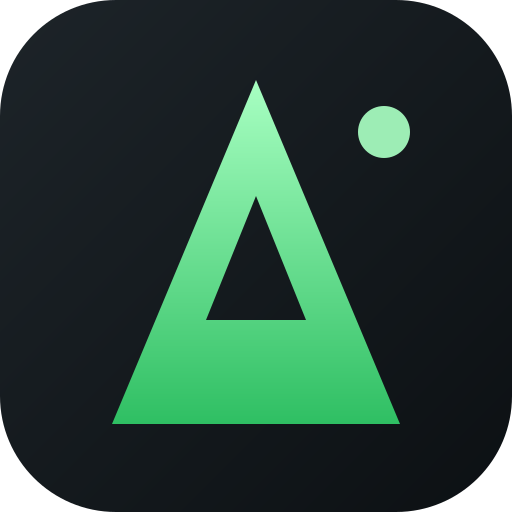

<div align="center">



<h3>The Agentic IDE for Open-Source Models</h3>


<p>
  <a href="https://github.com/deepvibe-eu/StageVibe/blob/main/LICENSE"></a>
</p>

</div>


<br />

---

## About the project

> **This repository is a personal fork of stagewise, called _StageVibe_.**
> Upstream documentation is kept below for reference. The fork focuses on a
> BYOK-first, local-first workflow and a few quality-of-life features that are
> documented in [StageVibe fork](#stagevibe-fork) further down.

**stagewise** is an open source agentic IDE for developers with a coding agent built right in.

- **Browse and build** in the same tool — no context switching
- **Work with a coding agent** that has **full access to your tab's console and debugger**
- **Make temporary test changes** or **connect a codebase** for permanent edits
- **Reverse-engineer** any website's components, style systems, and color palettes
- **IDE integration** to view and apply code changes in your favorite editor
- **Bring your own API key** — fully supported for all AI providers

## Getting Started

Build StageVibe from source (see [Development](#development)); packaged releases are published under [github.com/deepvibe-eu/StageVibe/releases](https://github.com/deepvibe-eu/StageVibe/releases).

## Use your coding subscription

Bring Your Own Key for all popular model providers — you can also register completely custom providers (including local inference!) and define custom models.

### Easy Import — use your existing subscription

Connect any of the following subscriptions with a single API key to unlock all models the provider offers directly inside stagewise.

| Subscription | Provider | Featured Models | Dashboard |
| ---------------- | ------------ | ------------------- | ------------- |
| Kimi | [Moonshot AI](https://platform.moonshot.ai) | Kimi K3, Kimi K2.7 Code, Kimi K2.6, Kimi K2.5 | [Get API key](https://platform.moonshot.ai/console/api-keys) |
| Qwen Coding Plan | [Alibaba DashScope](https://dashscope.console.aliyun.com) | Qwen 3-Coder 30B-A3B, Qwen 3-32B | [Get API key](https://dashscope.console.aliyun.com/apiKey) |
| MiniMax | [MiniMax](https://platform.minimax.io) | MiniMax M3, MiniMax M2.7 | [Get API key](https://platform.minimax.io/user-center/basic-information/interface-key) |
| Xiaomi MiMo | [Xiaomi MiMo](https://platform.xiaomimimo.com) | MiMo-V2.5-Pro, MiMo-V2.5 | [Get API key](https://platform.xiaomimimo.com/#/console/plan-manage) |
| Mistral | [Mistral](https://console.mistral.ai) | Mistral Medium 3.5, Mistral Large 3, Mistral Small 4, Codestral | [Get API key](https://console.mistral.ai/api-keys) |

### Bring Your Own API Key

Connect directly to any of the following API providers with your own key. For maximum flexibility, [OpenRouter](https://openrouter.ai) gives you access to 345+ models from all major vendors through a single API key.

| Provider | Featured Models | Dashboard |
| ------------- | ------------------- | ------------- |
| OpenRouter | Claude Opus 4.8, GPT-5.6 Sol, Gemini 3.1 Pro, DeepSeek V4 Pro | [Get API key](https://openrouter.ai/keys) |

### stagewise Account

For ease of use and immediate access to a large library of models, you can simply create a stagewise Account.

| Plan | Price | Limits |
| -------- | ------------- | ------------------------------- |
| Free | $0 / month | Limited access to 3 standard models (Default, Quick, Smart) |
| Pro | $20 / month | Access to all models, including Frontier and Open-Weights |
| Ultra | $200 / month | Access to all models, 15x higher limits than Pro |

Included models:

#### Open-Weight Models

- **Moonshot AI**: Kimi K3, Kimi K2.7 Code, Kimi K2.6, Kimi K2.5
- **Alibaba**: Qwen 3-32B, Qwen 3-Coder 30B-A3B
- **DeepSeek**: DeepSeek V4 Pro, DeepSeek V4 Flash
- **Z.ai**: GLM 5.2, GLM 5.1, GLM 5V-Turbo
- **MiniMax**: MiniMax M3, MiniMax M2.7, MiniMax M2
- **Xiaomi MiMo**: MiMo-V2.5-Pro, MiMo-V2.5
- **Mistral**: Mistral Medium 3.5, Mistral Large 3, Mistral Small 4, Codestral

#### Proprietary Models

- **Anthropic**: Fable 5, Opus 4.8, Opus 4.7, Opus 4.6, Sonnet 5, Sonnet 4.6, Haiku 4.5
- **OpenAI**: GPT-5.6 Sol, GPT-5.6 Terra, GPT-5.6 Luna, GPT-5.5, GPT-5.4, GPT-5.3 Codex, GPT-5.3 Instant, GPT-5.4 mini, GPT-5.4 nano
- **Google**: Gemini 3.5 Flash, Gemini 3.1 Pro (Preview), Gemini 3 Flash, Gemini 3.1 Flash Lite
- **xAI**: Grok 4.5

## StageVibe fork

This fork is built on top of upstream stagewise. It keeps the upstream
architecture (Electron app, Karton transport, `agent-core`) and adds the
following, focused changes.

### Bring Your Own Key first

Your own connections come first: coding plans, API keys and self-hosted/custom
endpoints are listed before the hosted Stagewise Inference provider
(`Settings → Models & Providers`). OpenRouter and Ollama work as usual.

### Manual context compaction

Long conversations are compacted automatically once the context usage crosses
a threshold, and you can also trigger it yourself:

- Click the **context-usage ring** next to the chat input.
- Or use the command center (`Ctrl/Cmd+K`).

The agent then summarises older messages into a briefing and keeps the recent
messages verbatim. All messages stay in the local SQLite database — only the
prompt sent to the model is shortened (the briefing is marked in the UI). The
usage ring updates immediately after a successful compaction.

### Markdown export

Every conversation can be exported or copied as Markdown, including tool
calls, reasoning (optional) and a marker for compacted regions:

- Right-click a chat in the sidebar → **Copy as Markdown** / **Export as Markdown…**
- Or the command center → _Export current chat as Markdown…_

File export opens a native save dialog (suggested name: `chat-title.md`).

### Privacy

- Telemetry defaults to **off**.
- Builds without a PostHog key start normally (no crash) — the telemetry
  client is not constructed at all.

### Linux AppImage

Besides `.rpm`/`.zip`, the fork can build a portable AppImage:

```bash
pnpm -F stagewise make --targets AppImage
# -> apps/browser/out/dev/make/AppImage/x64/*.AppImage
```

### Data directories & migration

After the StageVibe rename the app uses `~/…/stagevibe*` profiles and an `stagevibe`
data root. On first launch a one-time migration moves an existing
`stagewise*` profile over (never clobbering existing data); isolated dev
profiles fall back to the legacy `stagewise-dev` profile when seeding.

### Development

```bash
export PATH="$HOME/.local/node22/bin:$PATH"   # Node >= 22.12 for tooling
pnpm install

pnpm -F stagewise start:fast   # build workspace packages + start the app
pnpm -F stagewise start        # same, with typecheck first
pnpm build                     # build all workspace packages
pnpm -F stagewise package      # unpacked app
pnpm -F stagewise make --targets AppImage
```

Note: the toolchain runs on Node 22+, while the packaged app runs on
Electron's bundled Node (currently Electron 40 → Node 24.x); the About screen
lists those runtime versions under “Other versions”.

### Roadmap

- **Mavis skills**: bundle the Mavis agent personas and skills as built-in
  skills (`apps/browser/bundled/skills/…`). Skills are discovered by the agent
  via progressive disclosure and can also be invoked explicitly. Proprietary
  scripts are **re-implemented from scratch**, not copied.
- **i18n**: extract UI strings and add a language selector (German, French,
  Russian, Chinese) under `Settings → General`.
- **Layout**: relocate the console/terminal panel.

## License

StageVibe is a personal fork of [stagewise](https://github.com/stagewise-io/stagewise) (developed by stagewise GmbH) and is distributed under the AGPLv3 license.

For more information on the license model, visit the [FAQ about the GNU Licenses](https://www.gnu.org/licenses/gpl-faq.html).


## Issues

Feel free to [open an issue](https://github.com/stagewise-io/stagewise/issues/new) if you found a bug or have a fresh idea.

## Community & Support

- [Join our Discord](https://discord.gg/gkdGsDYaKA)
- Open an [issue on GitHub](https://github.com/stagewise-io/stagewise/issues/new) for dev support.
