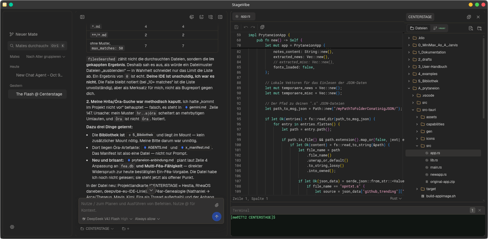

<div align="center">

<picture>
  <source media="(prefers-color-scheme: dark)" srcset=".github/assets/logo-combo-dark.svg">
  
</picture>

<h3>The Agentic IDE for Open-Source Models</h3>

<p>
  <a href="./locales/README.zh-CN.md">简体中文</a> ·
  <a href="./locales/README.de.md">Deutsch</a> ·
  <a href="./locales/README.ja.md">日本語</a> ·
  <a href="./locales/README.es.md">Español</a> ·
  <a href="./locales/README.ko.md">한국어</a> ·
  <a href="./locales/README.pt.md">Português</a> ·
  <a href="./locales/README.fr.md">Français</a> ·
  <a href="./locales/README.it.md">Italiano</a> ·
  <a href="./locales/README.hi.md">हिन्दी</a> ·
  <a href="./locales/README.ru.md">Русский</a> ·
  <a href="./locales/README.uk.md">Українська</a>
</p>

<p>
  <a href="https://github.com/stagewise-io/stagewise/blob/main/LICENSE"></a>
  <a href="https://github.com/stagewise-io/stagewise/stargazers"></a>
  <a href="https://discord.gg/gkdGsDYaKA"></a>
  <a href="https://x.com/stagewise_io"></a>
</p>

</div>



<br />

---

## About the project

> **This repository is a personal fork of stagewise, called _Agewise_.**
> Upstream documentation is kept below for reference. The fork focuses on a
> BYOK-first, local-first workflow and a few quality-of-life features that are
> documented in [Agewise fork](#agewise-fork) further down.

**stagewise** is an open source agentic IDE for developers with a coding agent built right in.

- **Browse and build** in the same tool — no context switching
- **Work with a coding agent** that has **full access to your tab's console and debugger**
- **Make temporary test changes** or **connect a codebase** for permanent edits
- **Reverse-engineer** any website's components, style systems, and color palettes
- **IDE integration** to view and apply code changes in your favorite editor
- **Bring your own API key** — fully supported for all AI providers

## Getting Started

Download stagewise from [stagewise.io](https://ade.stagewise.io) and follow the short onboarding guide to set up your account.

## Use your coding subscription

Bring Your Own Key for all popular model providers — you can also register completely custom providers (including local inference!) and define custom models.

### Easy Import — use your existing subscription

Connect any of the following subscriptions with a single API key to unlock all models the provider offers directly inside stagewise.

| Subscription | Provider | Featured Models | Dashboard |
| ---------------- | ------------ | ------------------- | ------------- |
| Kimi             | [Moonshot AI](https://platform.moonshot.ai) | Kimi K3, Kimi K2.7 Code, Kimi K2.6, Kimi K2.5 | [Get API key](https://platform.moonshot.ai/console/api-keys) |
| Qwen Coding Plan | [Alibaba DashScope](https://dashscope.console.aliyun.com) | Qwen 3-Coder 30B-A3B, Qwen 3-32B | [Get API key](https://dashscope.console.aliyun.com/apiKey) |
| MiniMax          | [MiniMax](https://platform.minimax.io) | MiniMax M3, MiniMax M2.7 | [Get API key](https://platform.minimax.io/user-center/basic-information/interface-key) |
| Xiaomi MiMo      | [Xiaomi MiMo](https://platform.xiaomimimo.com) | MiMo-V2.5-Pro, MiMo-V2.5               | [Get API key](https://platform.xiaomimimo.com/#/console/plan-manage) |
| Mistral          | [Mistral](https://console.mistral.ai) | Mistral Medium 3.5, Mistral Large 3, Mistral Small 4, Codestral | [Get API key](https://console.mistral.ai/api-keys) |

### Bring Your Own API Key

Connect directly to any of the following API providers with your own key. For maximum flexibility, [OpenRouter](https://openrouter.ai) gives you access to 345+ models from all major vendors through a single API key.

| Provider | Featured Models | Dashboard |
| ------------- | ------------------- | ------------- |
| OpenRouter    | Claude Opus 4.8, GPT-5.6 Sol, Gemini 3.1 Pro, DeepSeek V4 Pro | [Get API key](https://openrouter.ai/keys) |

### stagewise Account

For ease of use and immediate access to a large library of models, you can simply create a stagewise Account.

| Plan | Price | Limits |
| -------- | ------------- | ------------------------------- |
| Free     | $0 / month    | Limited access to 3 standard models (Default, Quick, Smart) |
| Pro      | $20 / month   | Access to all models, including Frontier and Open-Weights |
| Ultra    | $200 / month  | Access to all models, 15x higher limits than Pro |

Included models:

#### Open-Weight Models

- **Moonshot AI**: Kimi K3, Kimi K2.7 Code, Kimi K2.6, Kimi K2.5
- **Alibaba**: Qwen 3-32B, Qwen 3-Coder 30B-A3B
- **DeepSeek**: DeepSeek V4 Pro, DeepSeek V4 Flash
- **Z.ai**: GLM 5.2, GLM 5.1, GLM 5V-Turbo
- **MiniMax**: MiniMax M3, MiniMax M2.7, MiniMax M2
- **Xiaomi MiMo**: MiMo-V2.5-Pro, MiMo-V2.5
- **Mistral**: Mistral Medium 3.5, Mistral Large 3, Mistral Small 4, Codestral

#### Proprietary Models

- **Anthropic**: Fable 5, Opus 4.8, Opus 4.7, Opus 4.6, Sonnet 5, Sonnet 4.6, Haiku 4.5
- **OpenAI**: GPT-5.6 Sol, GPT-5.6 Terra, GPT-5.6 Luna, GPT-5.5, GPT-5.4, GPT-5.3 Codex, GPT-5.3 Instant, GPT-5.4 mini, GPT-5.4 nano
- **Google**: Gemini 3.5 Flash, Gemini 3.1 Pro (Preview), Gemini 3 Flash, Gemini 3.1 Flash Lite
- **xAI**: Grok 4.5

## Agewise fork

This fork is built on top of upstream stagewise. It keeps the upstream
architecture (Electron app, Karton transport, `agent-core`) and adds the
following, focused changes.

### Bring Your Own Key first

Your own connections come first: coding plans, API keys and self-hosted/custom
endpoints are listed before the hosted Stagewise Inference provider
(`Settings → Models & Providers`). OpenRouter and Ollama work as usual.

### Manual context compaction

Long conversations are compacted automatically once the context usage crosses
a threshold, and you can also trigger it yourself:

- Click the **context-usage ring** next to the chat input.
- Or use the command center (`Ctrl/Cmd+K`).

The agent then summarises older messages into a briefing and keeps the recent
messages verbatim. All messages stay in the local SQLite database — only the
prompt sent to the model is shortened (the briefing is marked in the UI). The
usage ring updates immediately after a successful compaction.

### Markdown export

Every conversation can be exported or copied as Markdown, including tool
calls, reasoning (optional) and a marker for compacted regions:

- Right-click a chat in the sidebar → **Copy as Markdown** / **Export as Markdown…**
- Or the command center → *Export current chat as Markdown…*

File export opens a native save dialog (suggested name: `chat-title.md`).

### Privacy

- Telemetry defaults to **off**.
- Builds without a PostHog key start normally (no crash) — the telemetry
  client is not constructed at all.

### Linux AppImage

Besides `.rpm`/`.zip`, the fork can build a portable AppImage:

```bash
pnpm -F stagewise make --targets AppImage
# -> apps/browser/out/dev/make/AppImage/x64/*.AppImage
```

### Data directories & migration

After the Agewise rename the app uses `~/…/agewise*` profiles and an `agewise`
data root. On first launch a one-time migration moves an existing
`stagewise*` profile over (never clobbering existing data); isolated dev
profiles fall back to the legacy `stagewise-dev` profile when seeding.

### Development

```bash
export PATH="$HOME/.local/node22/bin:$PATH"   # Node >= 22.12 for tooling
pnpm install

pnpm -F stagewise start:fast   # build workspace packages + start the app
pnpm -F stagewise start        # same, with typecheck first
pnpm build                     # build all workspace packages
pnpm -F stagewise package      # unpacked app
pnpm -F stagewise make --targets AppImage
```

Note: the toolchain runs on Node 22+, while the packaged app runs on
Electron's bundled Node (currently Electron 40 → Node 24.x); the About screen
lists those runtime versions under “Other versions”.

### Bundled skills

The fork ships built-in skills under `apps/browser/bundled/skills/`. They are
discovered by the agent (progressive disclosure: only the description loads
until the skill is relevant) and can also be invoked explicitly.

Re-authored for Agewise (`skill-creator` explains how to add more):

- **Skill Refiner** — fix an existing skill from evidence, with the smallest patch
- **Skill Creator** — turn a repeated workflow into a skill, with a lint script
  (`node scripts/lint-skill.mjs <skill-dir>`)
- **Deep Research** — a five-phase pipeline (background → direction → analysis →
  research → writing) that ends in a sourced report
- **Plan Mode** — settle the approach before writing code
- **Mate Personas** — role cards (coder, planner, verifier, generalist,
  orchestrator, skill editor)
- **Visual Page** — build a self-contained HTML page for diagrams, dashboards or
  comparisons
- plus the existing **Mate Team** and **Mate Doctor**

### Roadmap

- **More skills**: the remaining ones are daemon/CLI-bound (`.harness`,
  the daemon CLI, MCP/Lark tooling) or need heavy binary tooling
  (docx/xlsx/pptx/pdf); they get Agewise-native rewrites only where they add
  value.
- **i18n**: extract UI strings and add a language selector (German, French,
  Russian, Chinese) under `Settings → General`.
- **Layout**: relocate the console/terminal panel.

## License

stagewise is developed by stagewise GmbH and offered under the AGPLv3 license.

For more information on the license model, visit the [FAQ about the GNU Licenses](https://www.gnu.org/licenses/gpl-faq.html).

For use cases that fall outside the scope permitted by the AGPLv3 license, feel free to [contact us](mailto:sales@stagewise.io).

## Issues

Feel free to [open an issue](https://github.com/stagewise-io/stagewise/issues/new) if you found a bug or have a fresh idea.

## Community & Support

- [Join our Discord](https://discord.gg/gkdGsDYaKA)
- Open an [issue on GitHub](https://github.com/stagewise-io/stagewise/issues/new) for dev support.
